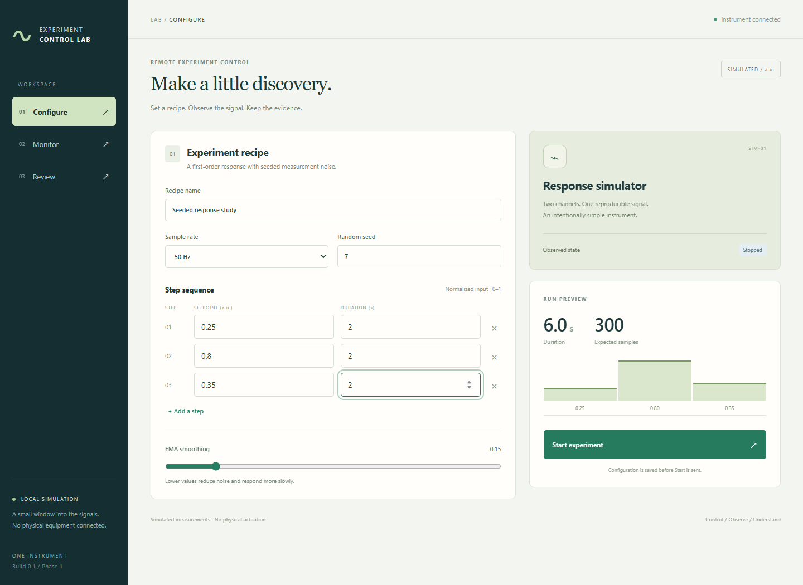

# Remote Experiment Control Lab

An experiment console built with React/TypeScript, Python/FastAPI, a separate
C++ simulator and PostgreSQL. Configure a stepped recipe, watch raw and filtered
measurements, confirm Stop, and inspect the immutable saved run.



## Run locally

Requires Docker with Linux containers and Compose, plus Python 3.12+ for the small
configuration helper. On Windows, use `py` in place of `python3`.

```sh
python3 scripts/setup.py
docker compose up -d --build --wait
```

Open **http://127.0.0.1:8000**. Initial builds download pinned dependencies and can
take several minutes. Start with the default 30-second recipe, or shorten each step
to two seconds for a quick demonstration.

`setup.py` creates an ignored `.env` with a random database password and preserves
existing configuration. UI/API port 8000 binds only to loopback; PostgreSQL and both
instrument ports stay on the private Compose network. This is explicitly an
unauthenticated local demo. For an authenticated cloud instance, see
[Render + Neon deployment](docs/HOSTING.md). A cloud deployment runs independently
of the development computer and has its own saved history.

Normal stop/restart preserves history:

```sh
docker compose stop
docker compose up -d --wait
```

Stopping the API during acquisition causes the engine to fault-stop on controller
loss. Reconnecting does not rerun the experiment. Acknowledge the instrument fault
before the next run. History remains visible while the instrument is disconnected.
See [troubleshooting](docs/TROUBLESHOOTING.md) for safe recovery.

## What is working in Phase 1

- Real control/telemetry TCP connections to a continuously running C++ process.
- One state owner, deterministic logical ticks, bounded queues, confirmed zero
  simulated output on Stop, and controller lease expiry.
- Bounded command deduplication and explicit conflicting-command rejection.
- PostgreSQL migrations, one controlling API worker, immutable snapshots/raw data,
  ordered EMA processing, event history and final-sequence recording reconciliation.
- Configure, Monitor and basic saved Review, including browser refresh during runs.
- Tests using real sockets, PostgreSQL, the complete API path and a real browser.

The simulator has no physical equipment connection. Stop is **not a hardware
emergency stop**. Timing is best effort; this does not demonstrate hard real-time
control or hardware synchronization.

## Verification

From the repository root, with Docker running:

```sh
docker compose build backend-test
docker compose run --rm backend-test sh -c 'pytest -q && ruff check . && ruff format --check . && mypy lab'
python3 tests/api_smoke.py
```

The API smoke test creates two clearly named synthetic saved runs. For frontend
checks, use Node 24.21.0:

```sh
cd frontend
npm ci
npm run build
npm test
npx playwright install chromium
npm run e2e
```

On Windows with Edge installed, set `PLAYWRIGHT_CHANNEL=msedge` before the browser
test to use Edge. Browser tests create demo runs. Set `UPDATE_SCREENSHOTS=1` to
refresh the documented screenshots. CI runs Chromium.

The C++ Docker build executes CTest. Additional [protocol/backpressure checks and
sanitizer commands](docs/TESTING.md) temporarily require the API to be stopped.
The Linux [CI workflow](.github/workflows/ci.yml) covers all these gates. A workflow
file is not evidence of a successful remote CI run; see [progress](docs/PROGRESS.md).

## Follow the code

- [Architecture and state table](docs/ARCHITECTURE.md)
- [Wire protocol and guarantees](docs/PROTOCOL.md)
- [Signal, timing and recording](docs/DATA.md)
- [Dependencies](docs/DEPENDENCIES.md)
- [Current checkpoint](docs/PROGRESS.md)

Next phases add durable telemetry acknowledgements/retransmission, comprehensive
failure reconciliation, CSV/replay, fuller recipe management and an educational
two-device clock-offset/drift demonstration. They are not advertised as complete.
No repository license has been selected.
